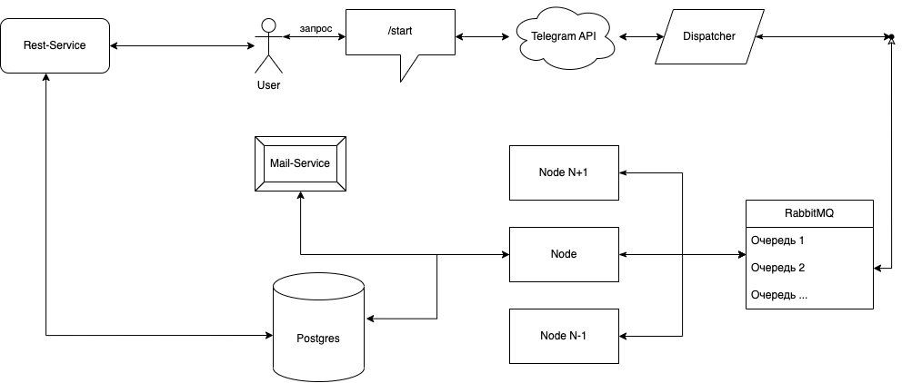
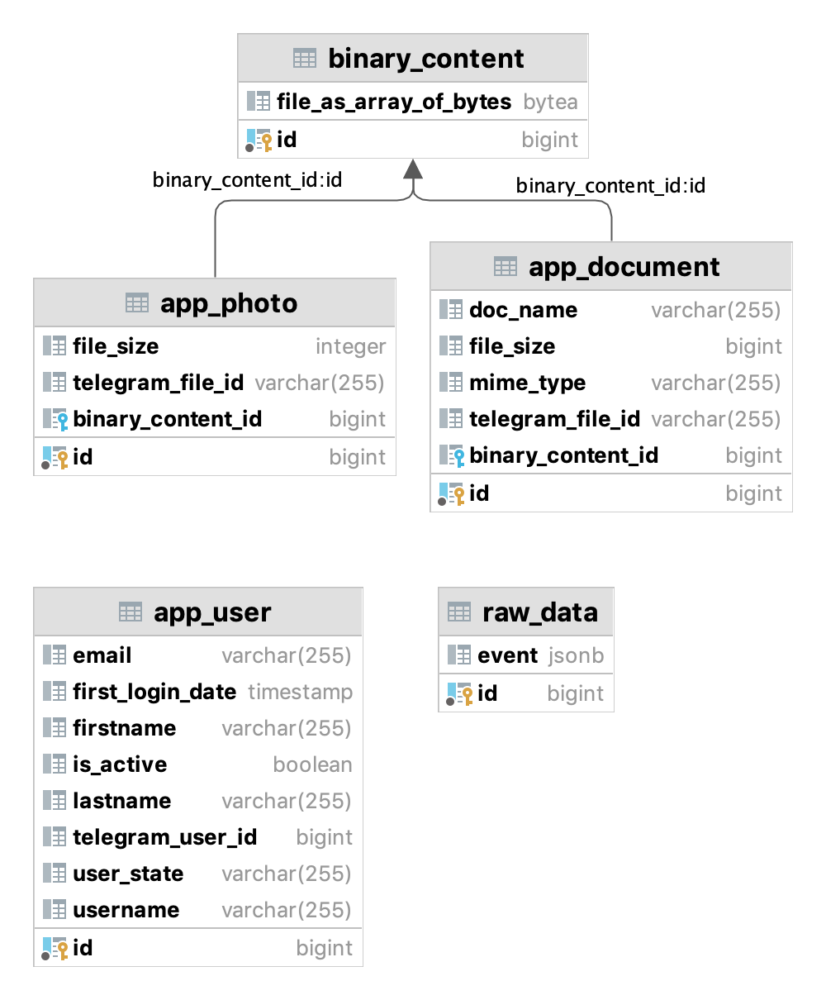

# **ConverterToLink Telegram Bot**

---
## [Вступление](#вступление)
- [Описание проекта](#описание-проекта)
- [Модули проекта](#модули-проекта)
- [Технологии](#технологии)

##  [Документация](#документация)
- [Dispatcher-Service](#dispatcher-service)
- [Node-Service](#node-service)
- [Mail-Service](#mail-service)
- [Rest-Service](#rest-service)
- [Common-RabbitMQ](#common-rabbitmq)
- [Common Utils](#common-utils)
- [Common-JPA](#common-jpa)

# Вступление
## Описание проекта

Этот проект представляет собой Telegram бот, разработанный на языке программирования Java. 
Основная функциональность бота заключается в сохранении файлов и фотографий, отправленных пользователем, в базу данных и генерации ссылки на скачивание этих файлов.
Ссылка на скачивание затем отправляется пользователю в ответном сообщении.

Для начала использования основных функций бота, пользователи выполняют следующие шаги:
1. **Регистрация**: Пользователи должны зарегистрироваться, указав свой адрес электронной почты.

2. **Подтверждение регистрации**: После регистрации пользователь получает письмо с уникальной ссылкой для подтверждения регистрации.

3. **Активация аккаунта**: После перехода по ссылке для подтверждения регистрации, аккаунт пользователя активируется, и он становится доступен для использования всех функций бота.

Эти шаги обеспечивают безопасность и удобство использования бота, обеспечивая авторизацию и защиту данных пользователей.
### Сервисные команды

- **/start**: запуск бота.
- **/help**: отображение справки.
- **/registration**: регистрация пользователя.
- **/help**: перечисление всех доступных команд.

### Структура сообщений и их обработка

Бот принимает сообщения в виде объектов Update. Сервис Dispatcher определяет тип сообщения и обрабатывает его следующим образом:

- текстовые сообщения: обрабатываются как команды в Телеграме.
- документы и файлы: сохраняются в базе данных, затем генерируется ссылка для скачивания и отправляется обратно пользователю.
- неизвестные команды: обрабатываются соответствующим образом.

### Процесс регистрации пользователя

Если пользователь не зарегистрирован:

1. Пользователь вводит адрес электронной почты.
2. Сообщение передается в сервис Dispatcher.
3. Dispatcher отправляет сообщение в RabbitMQ.
4. RabbitMQ отправляет сообщение в Mail-Service.
5. Пользователь получает письмо с ссылкой на подтверждение регистрации.
6. После успешной отправки письма, Dispatcher отправляет ответ пользователю в Телеграм.

### Активация почтового ящика

1. Пользователь переходит по ссылке из письма.
2. Rest-Service получает id пользователя.
3. Сервис ActivationService подтверждает активацию.
4. Пользователь получает сообщение об успешной активации.

### Процесс создания ссылки для скачивания

Если пользователь зарегистрирован:

1. Пользователь отправляет фото или документ в бот.
2. Сообщение передается в сервис Dispatcher.
3. Dispatcher отправляет сообщение в RabbitMQ.
4. RabbitMQ отправляет сообщение в сервис обработки Node.
5. Node сохраняет файл в базе данных и генерирует ссылку для скачивания.
6. Ссылка отправляется обратно в RabbitMQ.
7. Dispatcher отправляет ссылку пользователю в Телеграм.

### Процесс скачивания по ссылке

1. Пользователь переходит по ссылке на скачивание.
2. Rest-Service получает id файла.
3. Файл загружается из базы данных.
4. Файл отправляется пользователю.

## Модули проекта

1. **Dispatcher-Service**: Сервис для распределения сообщений с последующей отправкой их в брокер сообщений RabbitMQ.

2. **Node-Service**: 
   - Преобразовывает файлы в бинарный вид.
   - Загружает их в базу.
   - Формирует ответы к пользователю.

3. **Rest-Service**:
    - Запрашивает данные из БД.
    - Выгружает необходимый контент.
    - Отправляет сообщения пользователю.
    - Проверяет активацию пользователя после перехода по ссылке.

4. **Mail-Service**: Сервис для формирования активационного письма с ссылкой.

5. **Common-RabbitMq**: Общий модуль для работы с RabbitMQ.

6. **Common-Utils**: Модуль, выполняющий шифрование/расшифровку идентификаторов из параметров запроса.

7. **Common-JPA**: Общий модуль для работы с Java Persistence API (JPA).

## Технологии
- **Spring Boot**
- **RabbitMQ**
- **Docker**
- **SMTP**
- **PostgreSQL**
- **Hashids** 
- **Log4J**

# Документация
# Dispatcher-Service

Сервис Dispatcher представляет собой компонент, ответственный за маршрутизацию сообщений в системе. Он использует RabbitMQ для обмена сообщениями между различными компонентами системы.

##  Configuration
## RabbitConfiguration

Файл конфигурации RabbitConfiguration.java описывает настройки RabbitMQ и определяет очереди для обмена сообщениями.

### Очереди сообщений

Сервис Dispatcher определяет следующие очереди сообщений:

1. **textMessageQueue**: Очередь для текстовых сообщений. Каждое сообщение в этой очереди представляет собой текстовое обновление.

2. **docMessageQueue**: Очередь для документов. Каждое сообщение в этой очереди содержит информацию о документе.

3. **photoMessageQueue**: Очередь для фотографий. Каждое сообщение в этой очереди содержит информацию о фотографии.

4. **answerMessageQueue**: Очередь для ответов. Эта очередь используется для ответов на запросы и коммуникации с другими компонентами системы.

### Конвертер сообщений
Для сериализации и десериализации сообщений в формат JSON используется `Jackson2JsonMessageConverter`. Этот конвертер позволяет удобно передавать объекты между компонентами системы.

##  Controller
## 1. TelegramBot

Класс TelegramBot представляет собой Telegram-бота, который используется для взаимодействия с пользователем через мессенджер Telegram. Он реализует интерфейс TelegramLongPollingBot и обрабатывает входящие обновления от Telegram.

### Основные характеристики

- **Назначение**: Обеспечение взаимодействия с пользователем через мессенджер Telegram.
- **Основной функционал**: Прием и отправка сообщений, обработка обновлений от Telegram.
- **Используемые библиотеки**: TelegramBots API.

### Поля

1. **updateProcessor**: Компонент, ответственный за обработку входящих обновлений.
2. **botName**: Имя бота, получаемое из конфигурационных файлов.
3. **botToken**: Токен бота, получаемый из конфигурационных файлов.

### Методы

1. **getBotUsername()**: Метод, возвращающий имя бота.
2. **getBotToken()**: Метод, возвращающий токен бота.
3. **sendAnswerMessage(SendMessage message)**: Метод для отправки ответного сообщения. Принимает объект SendMessage и отправляет его через мессенджер Telegram.
4. **init()**: Метод, вызываемый после конструирования бина. Регистрирует бота в компоненте UpdateProcessor.
5. **onUpdateReceived(Update update)**: Метод, вызываемый при получении нового обновления от Telegram. Передает обновление на обработку в UpdateProcessor.

## 2. UpdateProcessor

### Введение

Класс `UpdateProcessor` представляет собой контроллер, ответственный за обработку входящих сообщений от Telegram бота. Он распределяет входящие обновления по различным типам сообщений и осуществляет их дальнейшую обработку или отправку в очередь RabbitMQ.

### Основные характеристики

- **Назначение**: Обработка и распределение входящих сообщений от Telegram бота.
- **Используемые библиотеки**: TelegramBots API, RabbitMQ.

### Поля

1. **telegramBot**: Экземпляр TelegramBot, с которым связан контроллер для отправки ответных сообщений.
2. **messageUtils**: Утилитарный класс для создания сообщений.
3. **updateProducer**: Сервис для отправки сообщений в очередь RabbitMQ.

### Конструктор

1. **UpdateProcessor(MessageUtils messageUtils, UpdateProducer updateProducer)**: Конструктор, принимающий утилитарный класс для работы с сообщениями и сервис для отправки сообщений в очередь.

### Методы

1. **registerBot(TelegramBot telegramBot)**: Метод для внедрения зависимости от экземпляра TelegramBot.
2. **precessUpdate(Update update)**: Метод для обработки входящего обновления от Telegram. Распределяет обновления по типам сообщений.
3. **distributeMessagesByType(Update update)**: Приватный метод для дальнейшего распределения обновлений в зависимости от их типа.
4. **setView(SendMessage sendMessage)**: Метод для отправки сообщения обратно пользователю через Telegram бота.
5. **setFileIsReceivedView(Update update)**: Метод для отправки сообщения о успешном получении файла.
6. **setUnsupportedMessageTypeView(Update update)**: Метод для отправки сообщения об ошибке при получении неподдерживаемого типа сообщения.
7. **processTextMessage(Update update)**: Метод для обработки текстового сообщения и отправки его в очередь RabbitMQ.
8. **processPhotoMessage(Update update)**: Метод для обработки фото-сообщения, отправки его в очередь RabbitMQ и отправки ответного сообщения о получении файла.
9. **processDocumentMessage(Update update)**: Метод для обработки документа, отправки его в очередь RabbitMQ и отправки ответного сообщения о получении файла.

## Service
## 1. AnswerConsumerImpl

Класс `AnswerConsumerImpl` представляет собой сервис, ответственный за прием ответных сообщений от сервиса Node и передачу их в `UpdateProcessor` для дальнейшей обработки и отправки через Telegram бота.

### Основные характеристики

- **Назначение**: Прием ответных сообщений и их передача для отправки через Telegram бота.
- **Используемые библиотеки**: Spring AMQP (RabbitMQ), TelegramBots API.

### Поля

1. **updateProcessor**: Экземпляр `UpdateProcessor`, через который осуществляется отправка ответных сообщений.

### Конструктор

1. **AnswerConsumerImpl(UpdateProcessor updateProcessor)**: Конструктор, принимающий экземпляр `UpdateProcessor` для взаимодействия с контроллером обновлений.

### Методы

1. **consume(SendMessage sendMessage)**: Метод, аннотированный как `@RabbitListener`, который принимает ответное сообщение в виде объекта `SendMessage` и передает его в `UpdateProcessor` для отправки через Telegram бота.

## 2. UpdateProducerImpl

Класс `UpdateProducerImpl` является реализацией сервиса `UpdateProducer`, который отвечает за отправку сообщений в очередь RabbitMQ. Он получает сообщение в виде объекта `Update` от Telegram и передает его в RabbitMQ для дальнейшей обработки.

### Основные характеристики

- **Назначение**: Отправка сообщений в очередь RabbitMQ.
- **Используемые библиотеки**: Spring AMQP (RabbitMQ), TelegramBots API.

### Поля

1. **rabbitTemplate**: Шаблон RabbitMQ для отправки сообщений в очередь.

### Конструктор

1. **UpdateProducerImpl(RabbitTemplate rabbitTemplate)**: Конструктор, принимающий экземпляр RabbitTemplate для взаимодействия с RabbitMQ.

### Методы

1. **produce(String rabbitQueue, Update update)**: Метод для отправки сообщения в указанную очередь RabbitMQ. Принимает имя очереди `rabbitQueue` и объект `Update`, который будет отправлен.

## MessageUtils

### Введение

Класс `MessageUtils` представляет собой компонент, предназначенный для удобной генерации объектов `SendMessage`, которые используются для отправки промежуточных сообщений через контроллер `UpdateProcessor` в приложении Telegram.

### Основные характеристики

- **Назначение**: Генерация объектов `SendMessage` для отправки промежуточных сообщений в Telegram.
- **Используемые библиотеки**: TelegramBots API.

### Методы

1. **generateSendMessageWithText(Update update, String text)**:
   - **Описание**: Метод для генерации объекта `SendMessage` с указанным текстом для отправки пользователю.
   - **Параметры**:
      - `update`: Объект `Update` из Telegram, содержащий информацию о полученном сообщении.
      - `text`: Текст сообщения, который нужно отправить.
   - **Возвращаемое значение**: Объект `SendMessage`, содержащий информацию о текстовом сообщении, готовом к отправке.

# Node-Service
# Configuration

## 1. NodeConfiguration
### Обзор
Класс `NodeConfiguration` создает бин для `CryptoTool`. Класс `CryptoTool` используется для криптографической обработки, включая шифрование и дешифрование.

### Подробности конфигурации

- **Создание бина**: Создается экземпляр `CryptoTool` с указанным значением соли.
- **Параметр**: Параметр `salt` используется в качестве ключа для криптографической обработки.

## 2. RabbitConfiguration

Этот класс представляет собой конфигурацию для RabbitMQ.

### Обзор

Класс `RabbitConfiguration` определяет бин `jsonMessageConverter`, который является конвертером сообщений. При отправке сообщений в RabbitMQ, они должны быть сконвертированы в формат, понятный RabbitMQ. В данном случае, используется JSON формат для сообщений.

### Подробности конфигурации

- **jsonMessageConverter**: Бин, созданный для конвертирования сообщений в JSON формат. Это необходимо для того, чтобы сообщения, отправляемые в RabbitMQ, могли быть правильно обработаны.

# Service

## 1. AppUserService

Этот сервис предоставляет функциональность для регистрации пользователей и установки их электронной почты.

### Обзор

Сервис `AppUserServiceImpl` реализует интерфейс `AppUserService` и предоставляет следующие функции:

- `registerUser(AppUser appUser)`: Регистрирует пользователя и инициирует процесс подтверждения регистрации по электронной почте.
- `setEmail(AppUser appUser, String email)`: Устанавливает электронную почту для пользователя и отправляет письмо для подтверждения активации.

## 2. ConsumerService

Этот сервис предназначен для чтения сообщений из брокера RabbitMQ и их обработки.

### Обзор

Сервис `ConsumerServiceImpl` реализует интерфейс `ConsumerService` и обеспечивает прием сообщений из очередей RabbitMQ. Каждый метод сервиса прослушивает определенную очередь и вызывает соответствующий метод сервиса `MainService` для обработки полученных сообщений.

### Методы

- `consumeTextMessageUpdate(Update update)`: Обрабатывает сообщения текстового формата.
- `consumeDocMessageUpdate(Update update)`: Обрабатывает сообщения с документами.
- `consumePhotoMessageUpdate(Update update)`: Обрабатывает сообщения с фотографиями.

## 3. FileService

Этот сервис предоставляет функциональность для загрузки файлов из сообщений Telegram, их сохранения в базе данных и генерации ссылок для доступа к ним.

### Обзор

Сервис `FileServiceImpl` обеспечивает обработку документов и фотографий, полученных из сообщений в Telegram. Документы и фотографии сохраняются в базе данных, а также генерируются ссылки для доступа к ним.

### Методы

- `processDoc(Message telegramMessage)`: Обрабатывает документы, полученные из сообщений в Telegram.
- `processPhoto(Message telegramMessage)`: Обрабатывает фотографии, полученные из сообщений в Telegram.
- `generateLink(Long documentId, LinkType linkType)`: Генерирует ссылку для доступа к загруженному документу.

### Конфигурация

- `telegram.bot.token`: Токен Telegram бота.
- `telegram.bot.file_info.uri`: URI для получения информации о файле из Telegram.
- `telegram.bot.file_storage.uri`: URI для загрузки файлов из Telegram.
- `link.address`: Адрес, по которому будут доступны сгенерированные ссылки.

## 4. MainService

Этот сервис отвечает за обработку всех входящих сообщений, поступающих в систему.

### Обзор

Сервис `MainServiceImpl` отвечает за обработку текстовых сообщений, фотографий и документов, полученных из сообщений в Telegram. Он также управляет регистрацией пользователей, обработкой команд и генерацией ответных сообщений.

### Методы

- `processTextMessage(Update update)`: Обрабатывает текстовые сообщения, выполняет регистрацию пользователей и обрабатывает команды.
- `processPhotoMessage(Update update)`: Обрабатывает сообщения с фотографиями.
- `processDocMessage(Update update)`: Обрабатывает сообщения с документами.
- `isNotAllowToSendContent(Long chatId, AppUser appUser)`: Проверяет, разрешено ли отправлять контент пользователю.
- `sendAnswer(String output, Long chatId)`: Отправляет ответное сообщение пользователю.
- `processServiceCommands(AppUser appUser, String command)`: Обрабатывает команды от пользователя.
- `cancelProcess(AppUser appUser)`: Отменяет текущую операцию пользователя.
- `findOrSaveAppUser(Update update)`: Находит или сохраняет информацию о пользователе.
- `saveRawData(Update update)`: Сохраняет сырые данные, полученные из сообщений.

## 5. ProducerService

Этот сервис отвечает за отправку ответов из ноды в брокер RabbitMQ.

### Обзор

Сервис `ProducerServiceImpl` используется для отправки ответных сообщений из ноды в брокер сообщений RabbitMQ.

### Методы

- `produceAnswer(SendMessage sendMessage)`: Отправляет ответное сообщение в брокер RabbitMQ.

# Mail-Service
## MailController

Этот контроллер отвечает за обработку запросов на отправку почтовых сообщений.

### Обзор

Контроллер `MailController` обрабатывает HTTP POST запросы по пути `/mail/send` для отправки почтовых сообщений.

### Методы

- `sendActivationMail(@RequestBody MailParams mailParams)`: Обрабатывает POST запрос и отправляет почтовое сообщение с помощью сервиса `MailSenderService`.

## MailService

Этот сервис отвечает за отправку электронных писем.

### Обзор

Сервис `MailServiceImpl` предоставляет функциональность для отправки электронных писем с помощью JavaMailSender.

### Методы

- `sendMail(MailParams mailParams)`: Метод отправляет электронное письмо на указанный адрес с заданным текстом и темой.
   - `mailParams`: Параметры письма, включая адрес получателя и идентификатор активации.

### Конфигурация

- `spring.mail.username`: Настройка имени пользователя для отправки писем.
- `service.activation.uri`: URI для активации учетной записи в письме.

# Rest-Service
## RestServiceConfiguration

Этот конфигурационный класс предоставляет бин для работы с криптографическими операциями в REST-сервисе.

### Обзор

Конфигурационный класс `RestServiceConfiguration` создает бин `CryptoTool`, который используется для выполнения криптографических операций в REST-сервисе.

### Зависимости

- `CryptoTool`: Утилита для выполнения криптографических операций.

### Методы

- `getCryptoTool()`: Метод создает экземпляр `CryptoTool` с переданным солью (salt) в качестве параметра.

### Параметры

- `salt`: Соль, используемая для криптографической обработки данных.

## Controller
## 1. ActivationController

Этот контроллер предоставляет точку входа для активации пользователей по ссылке из письма.

### Обзор

Контроллер `ActivationController` обрабатывает GET-запросы по пути `/user/activation` для активации пользователей по переданному идентификатору.

### Методы

- `activation(String id)`: GET-метод, который вызывает сервис активации пользователя по переданному идентификатору.

### Параметры запроса

- `id`: Идентификатор пользователя, который используется для активации.

## 2. FileController

Этот контроллер обрабатывает запросы пользователя для загрузки файлов.

### Обзор

Контроллер `FileController` предоставляет два метода для загрузки документов и фотографий:
- `getDocument`: GET-метод для загрузки документа по его идентификатору.
- `getPhoto`: GET-метод для загрузки фотографии по ее идентификатору.

### Методы

- `getDocument(String id, HttpServletResponse response)`: GET-метод для загрузки документа.
- `getPhoto(String id, HttpServletResponse response)`: GET-метод для загрузки фотографии.

### Параметры запроса

- `id`: Идентификатор документа или фотографии, который используется для загрузки.

# Service
## 1. FileService

Этот сервис предоставляет функциональность для работы с файлами.

### Обзор

Сервис `FileServiceImpl` позволяет получать документы и фотографии по их хэшам.

### Методы

- `getDocument(String hash)`: Получает документ по его хэшу.
- `getPhoto(String hash)`: Получает фотографию по ее хэшу.

### Параметры

- `hash`: Хэш, используемый для получения документа или фотографии.

## 2. UserActivationService

Этот сервис предназначен для активации пользователей.

### Обзор

Сервис `UserActivationServiceImpl` позволяет активировать пользователей по их идентификатору пользователя в криптографическом формате.

### Методы

- `activation(String cryptoUserId)`: Активирует пользователя по его идентификатору в криптографическом формате.

### Параметры

- `cryptoUserId`: Идентификатор пользователя в криптографическом формате.

# Common-RabbitMQ

В этом модуле определены названия очередей RabbitMQ, используемых в приложении.

### Обзор

Класс `RabbitQueue` содержит константы для определения названий очередей RabbitMQ, которые используются для обмена сообщениями в приложении.

### Очереди

1. `DOC_MESSAGE_UPDATE`: Очередь для обновлений, содержащих документы.
2. `PHOTO_MESSAGE_UPDATE`: Очередь для обновлений, содержащих фотографии.
3. `TEXT_MESSAGE_UPDATE`: Очередь для обновлений, содержащих текстовые сообщения.
4. `ANSWER_MESSAGE`: Очередь для отправки ответов из приложения в RabbitMQ.

# Common Utils

В этом модуле содержатся утилитарные классы и DTO (Data Transfer Objects) для различных целей.

## CryptoTool

### Описание
Класс `CryptoTool` предоставляет функционал для шифрования и расшифровки идентификаторов, используемых в параметрах запросов. Он защищает идентификаторы от прямого поиска в базе данных путем их хеширования.

### Методы

1. `hashOf(Long value)`: Метод для хеширования идентификатора типа Long.
2. `idOf(String value)`: Метод для расшифровки хеша и получения исходного идентификатора типа Long.

## MailParams

### Описание
DTO `MailParams` используется для передачи параметров при отправке электронной почты.

### Поля

1. `id`: Идентификатор, используемый в контексте отправки почты.
2. `emailTo`: Адрес электронной почты, на который отправляется сообщение.

# Common-JPA

В этом пакете содержатся классы сущностей, которые отображают таблицы базы данных.

## AppDocument

### Описание
Класс `AppDocument` представляет собой сущность, представляющую документ, загруженный в систему. Он содержит информацию о документе, такую как идентификатор Telegram, имя документа, содержимое в бинарном формате, тип MIME и размер файла.

### Поля
1. `id`: Идентификатор документа.
2. `telegramFileId`: Идентификатор файла в Telegram.
3. `docName`: Название документа.
4. `binaryContent`: Бинарное содержимое документа.
5. `mimeType`: MIME-тип документа.
6. `fileSize`: Размер файла.

## AppPhoto

### Описание
Класс `AppPhoto` представляет собой сущность, представляющую фотографию, загруженную в систему. Он содержит информацию о фотографии, такую как идентификатор Telegram, содержимое в бинарном формате и размер файла.

### Поля
1. `id`: Идентификатор фотографии.
2. `telegramFileId`: Идентификатор файла в Telegram.
3. `binaryContent`: Бинарное содержимое фотографии.
4. `fileSize`: Размер файла.

## AppUser

### Описание
Класс `AppUser` представляет собой сущность, представляющую пользователя системы. Он содержит информацию о пользователе, такую как идентификатор Telegram, дата первого входа, имя, фамилия, имя пользователя, адрес электронной почты, статус активации и текущее состояние пользователя.

### Поля
1. `id`: Идентификатор пользователя.
2. `telegramUserId`: Идентификатор пользователя в Telegram.
3. `firstLoginDate`: Дата первого входа.
4. `firstname`: Имя пользователя.
5. `lastname`: Фамилия пользователя.
6. `username`: Имя пользователя в Telegram.
7. `email`: Адрес электронной почты пользователя.
8. `isActive`: Статус активации пользователя.
9. `userState`: Текущее состояние пользователя.

## BinaryContent

### Описание
Класс `BinaryContent` представляет собой сущность, содержащую бинарное содержимое файла. Он используется для хранения бинарных данных, таких как содержимое документов и фотографий.

### Поля
1. `id`: Идентификатор бинарного содержимого.
2. `fileAsArrayOfBytes`: Бинарное содержимое файла в виде массива байтов.

